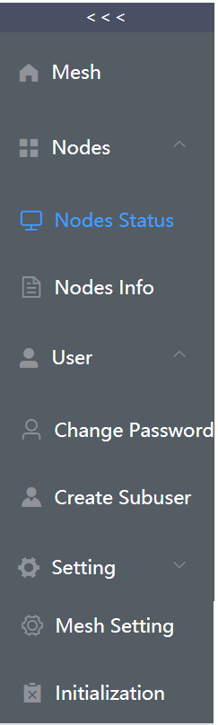
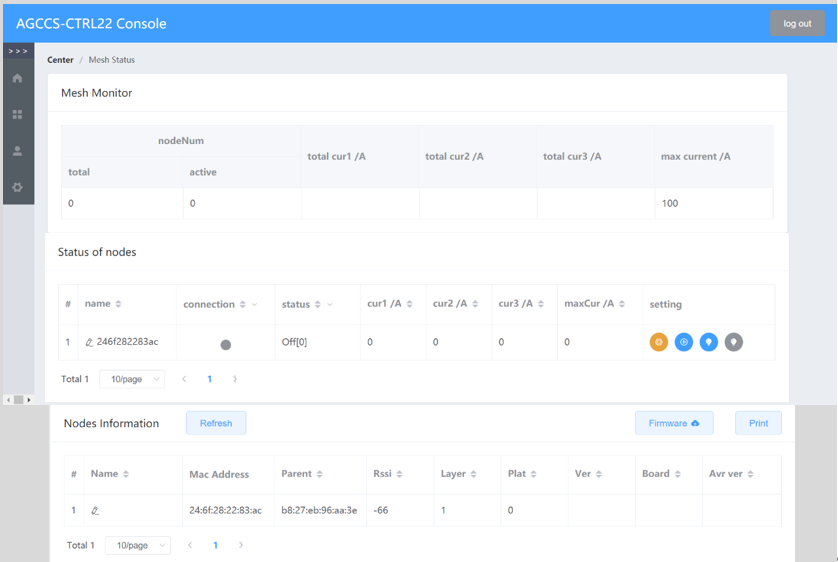

## UI for project AGCCS-CTRL22

This programm aims to develop a web user interface for the Combined Charging System from project AGCCS. A supporting server program (see [UI-server](https://github.com/AGCCS/UI-server)) is needed for regular operation of this UI.

The whole work is developed based on Vue.js and uses Element UI as the UI toolkit.

### Instruction of functions
This userinterface start with a Login interface. In order to simplify the login process and facilitate testing in development process, the default username 'admin' and its password '123456' is provided to simplify the login process . After successful login, you will enter the default interface 'Mesh Monitor'， which is the console of the whole mesh. On its left side stands a sidebar as the main navigation.

 

The sidebar has now 4 submenus, 'mesh', 'nodes', 'user' and 'setting'. Every submenu except 'mesh' has 2 options. The sidemenu is collapsed by default. People can use the option '>>>' to expand it, which is on the top of sidemenu. When people have selected the submenu of one console, the expanded sidemenu will be collapsed.

The submenu 'mesh' will lead u to the main console 'Mesh Monitor' mentioned before. The 'Mesh Monitor' shows only the data of the whole mesh, which includes the total number of connected nodes, the number of active nodes, the value of total used current in 3 phases and the maximum current that the whole mesh could supply.

In the submenu 'nodes' there are two more consoles 'Nodes Status' and 'Nodes Info'. The console 'Nodes Status' shows the name, the connection, the working status and the value of current in each phases of nodes. The default node name is its mac address. The settings of node can be changed with the small circle buttons in last column of the table. These buttons should only be clicked when the node is connected. There will be a an additional dialog after clicking the first button and other buttons will take effect immediately after clicking. When the node is in working status 'off' of 'err', all the options and input boxes are deactivated. The input box of maximum current and phases of the node will still be deactivated, if the node is in workmode 'auto', even though the node is in an active working status. After the electric vehicle is charged, which means the node returns to the state 'off', the workmode will be reset to 'auto'. The console 'Nodes Info' shows all the important information of all the nodes that is recorded by the server. Their name, mac address, parent node, rssi, layer of mesh, plat, version of the programm of ESP32, name of board and the version of the programm of AVR. On the top of the table in 'Nodes Info' there are 3 buttons. 'Refresh' and 'Print' have the same function as the name. Use 'Firmware' will bring up a new dialog. There people should select the board corresponding to the firmware at first and then upload the file of firmware by clicking or dragging. If the board is 'AVR', there will be an additional dialog to select the node that should be uploaded to.

In the submenu 'user' there are 2 options 'change password' and 'create subuser'. As for the submenu 'setting' there are also 2 options 'Mesh Setting' and 'Initialization'. Now there is only one setting for the whole mesh, the total max current value. Since 'initialization' will delete all recorded node information, in order to make it effective, only the admin can make it effective after entering its username 'admin' and password.

All the operations that are mentioned above is forbidden for subuser but changing the password.

### Guidelines for Installation


##### Development environment
nodejs v14.15.3 and npm v6.14.10 (compatibility of lower version hasn't been tested)

##### Project setup
```
npm install
```

##### Compiles and hot-reloads for development
```
npm run serve
```
##### Compiles and minifies for production
```
npm run build
Then copy the folder dist into the folder of server.
```
##### Lints and fixes files
```
npm run lint
```

### Requirement
Local api-server is required to run this user interface, which are in the express-api-server.
